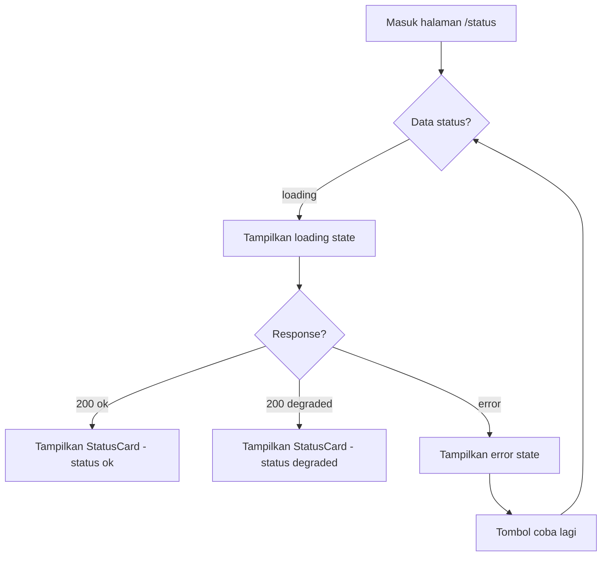

# User Flow — System Status Screen

**Design workspace:** `design/flows/`
**Referensi:** `design/handoff/DESIGN-1/`, backend `GET /api/v1/status`

## Flow

## State

| State | Trigger | UI |
|-------|---------|-----|
| Loading | fetch pending | teks "Memuat status sistem..." + pulse |
| Success | 200, `status: ok` | dot hijau + `ok` + version + uptime |
| Degraded | 200, `status: degraded` | dot kuning + `degraded` |
| Error | fetch gagal | teks "Gagal: <pesan>" merah |

## Skenario

- User buka `/status` langsung → auto fetch.
- Backend turun → error state + retry.
- Backend balas `degraded` → warning dot, bukan merah (masih tersedia sebagian).

Flow minimal — status screen pilot tidak punya multi-step navigation.
